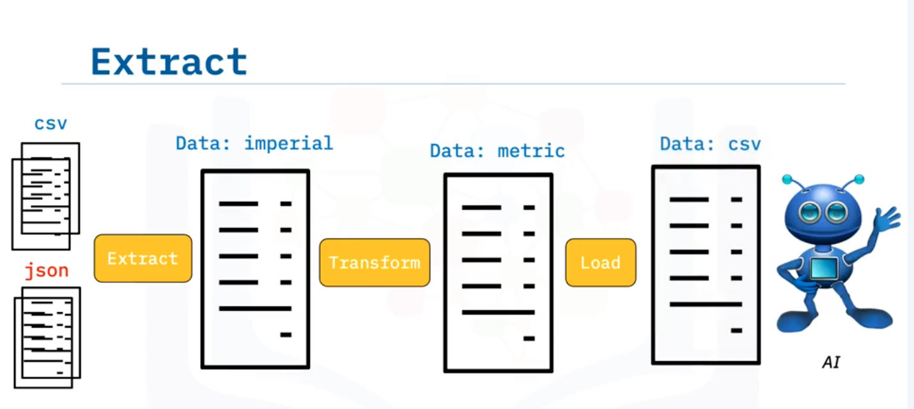

#  About This Project

Welcome to the **ETL Data Engineering Project**!

This project demonstrates how to build a simple ETL (Extract, Transform, Load) pipeline using **Python** and **Pandas**.  
The pipeline collects data from multiple file formats (CSV and JSON and XML), transforms it into a unified structure, and saves it into a new CSV file.

## Main Features
- 📥 Extract data from multiple CSV and JSON files automatically.
- 🔄 Transform data: Convert units (height from inches to meters, weight from pounds to kilograms).
- 💾 Load the cleaned and transformed data into a single target CSV file.
- 📝 Log every ETL step into a logfile with timestamps.

##  Technologies Used
- Python 3
- Pandas
- Glob
- Logging
- CSV and JSON file handling

##  Target Audience
- Data Engineering beginners
- Python developers
- Students interested in ETL pipelines
- Anyone curious about batch processing

## 📂 Project Structure

## Einleitung

> **Have you ever wondered how data was collected from multiple sources and combined to become a single source of information?**
>
> This type of data collection is called **Batch processing**, and today we will be exploring a type of batch processing called **Extract, Transform and Load (ETL)**.
>
> **ETL** does exactly what the name implies. It is the process of extracting large amounts of data from multiple sources and formats and transforming it into one specific format before loading it into a database or target file.
>
> **Example:**
> Imagine you are the owner of a start-up that built an AI model to predict if someone is at risk for diabetes based on their height and body weight.
> Some of your data is in **CSV** format, while the other data is in **JSON** and **XML** files.



## ETL Prozess Überblick

- **Extract**: Daten werden aus CSV- und XML- und JSON-Dateien extrahiert.
- **Transform**: Daten werden konvertiert (z.B. Höhe von Zoll auf Meter).
- **Load**: Die verarbeiteten Daten werden in eine neue CSV-Datei gespeichert.

## Ausführen des Projekts

```bash
python etl.py
```
